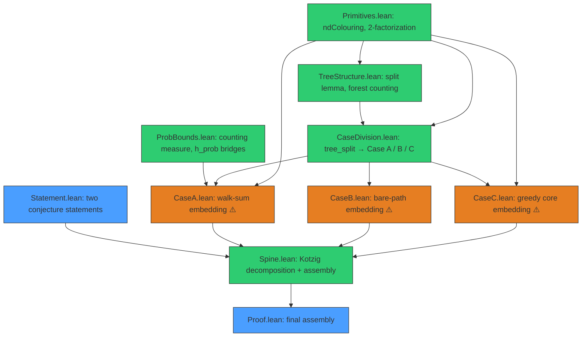

# 🌳 Ringel's Conjecture in Lean 4

<p align="center">
  <b>A Lean 4 formalization of the Montgomery–Pokrovskiy–Sudakov proof of Ringel's Conjecture.</b><br/>
  <i>Every tree with n edges packs 2n+1 times into the complete graph K₂ₙ₊₁.</i>
</p>

<p align="center">
  
  
</p>

---

Ringel's Conjecture (1963): for every tree `T` with `n` edges, the complete graph `K_{2n+1}` on
`2n+1` vertices decomposes into `2n+1` edge-disjoint copies of `T`. It was proved for all
sufficiently large `n` by R. Montgomery, A. Pokrovskiy and B. Sudakov (arXiv:2001.02665). This
repository formalizes that proof in Lean 4.

The two statements live in [`Ringel/Statement.lean`](Ringel/Statement.lean). The all-`n` form
`ringel_conjecture` is open in general; the large-`n` form `ringel_conjecture_large` is the form
Montgomery–Pokrovskiy–Sudakov actually proved, and is the target of this formalization.

```lean
theorem ringel_conjecture_large :
    ∀ᶠ (n : ℕ) in Filter.atTop, ∀ {V : Type*} [Finite V] (T : SimpleGraph V),
      T.IsTree → T.edgeSet.ncard = n →
      ∃ f : Fin (2 * n + 1) → (V ↪ Fin (2 * n + 1)),
        Pairwise (fun i j => Disjoint (T.map (f i)).edgeSet (T.map (f j)).edgeSet) ∧
        ⨆ i, T.map (f i) = (⊤ : SimpleGraph (Fin (2 * n + 1)))
```

A "copy" of `T` is the image `T.map (f i)` under a vertex embedding `f i : V ↪ Fin (2n+1)`; the two
conditions say the copies are pairwise edge-disjoint and together cover every edge of `K_{2n+1}`.

---

## Status

The project compiles (`lake build`, zero errors). The deterministic combinatorial backbone—including
the full proof spine wiring all components end-to-end—is formalized and axiom-clean. The remaining
`sorry`s (4 sites across 3 files) are genuinely deep probabilistic / extremal steps that Mathlib
does not yet support.

### Done — sorry-free

- [x] Both conjecture statements formalized (`Statement.lean`)
- [x] **ND-colouring** — `ndColouring` fully implemented with symmetry proof, shift-invariance,
      the `±(c+1)` step lemma, and the complete 2-factorization theorem (`Primitives.lean`)
- [x] **Split lemma** — a tree on `n` vertices has either many leaves or many vertex-disjoint bare
      paths, plus `tree_split_via_split` (MPS Lemma 2.2) and the full supporting stack of
      forest-counting / handshake / connected-component-identity lemmas (~956 lines, all sorry-free)
      (`TreeStructure.lean`)
- [x] **Case division** — routes a tree into Case A, B, or C (`CaseDivision.lean`)
- [x] **Case A tree embedding** — signed walk-sum construction (`walkSum`, `tree_embed`,
      `exists_embed_from_signs`) proving the ND-colouring step realizes the right colours (`CaseA.lean`)
- [x] **Case C greedy core embedding** — `caseC_embed_core` via `Finset.strongInduction` (~200 lines),
      plus `exists_fresh_position`, structural decomposition, and forest edge-counting (`CaseC.lean`)
- [x] **Kotzig cyclic-shift decomposition** — `decomp_of_rainbow_copy`: a single rainbow copy of `T`
      yields `2n+1` edge-disjoint copies covering `K_{2n+1}` (~165 lines, sorry-free) (`Spine.lean`)
- [x] **Proof spine** — `rainbow_copy_exists` combines the case division with Cases A/B/C via
      `filter_upwards`; `ringel_conjecture_large_via_spine` composes everything (`Spine.lean`)
- [x] **Probability infrastructure** — counting measure, positive-probability ⟹ existence bridge
      lemmas that cleanly isolate the `h_prob > 0` hypotheses (`ProbBounds.lean`)

### Remaining — the deep pillars (4 `sorry` sites)

| # | File | Lemma | What's needed |
|---|------|-------|---------------|
| 1 | `CaseA.lean:208` | `bound_vertex_collisions` | **Littlewood–Offord anticoncentration** — the probability that random signs produce an injective vertex map. Mathlib has no Littlewood–Offord; must be built from Sperner / antichain machinery. |
| 2 | `CaseA.lean:356` | `exists_absorption_matching` | **Absorption matching probability** — the probability that a random leaf placement gives a valid Hall matching. Hall's theorem is in Mathlib; the absorption argument around it is not. |
| 3 | `CaseB.lean:13` | `caseB_embedding_exists` | **Case B embedding** — the full bare-path embedding strategy (entire body is `sorry`). The largest remaining unit; builds on two prior papers. |
| 4 | `CaseC.lean:443` | `caseC_extend_embedding` | **Case C leaf extension** — extending the core embedding to leaves via 2-factorization. |

*Additionally, `Statement.lean` contains two `sorry`-bodied placeholders for the headline theorems;
these are intentional—the actual proof is assembled in `Spine.lean` and `Proof.lean`.*

**Out of scope:** `ringel_conjecture` (the all-`n` original) stays `sorry` — it is open in general
and is *not* what MPS proved. Only `ringel_conjecture_large` is the goal here.

---

## Module map

| File | Lines | Contents |
|------|-------|----------|
| `Ringel/Statement.lean`     | 57    | The two theorem statements (all-`n` and large-`n`). |
| `Ringel/Primitives.lean`    | 323   | `ndColouring` (near-difference rainbow colouring), 2-factorization, case predicates. |
| `Ringel/TreeStructure.lean` | 956   | `split` + small-`δ` case division and all tree/forest counting infrastructure (sorry-free). |
| `Ringel/CaseDivision.lean`  | 26    | `tree_split` / `case_division`: routes a tree into Case A, B, or C. |
| `Ringel/CaseA.lean`         | 425   | Long-bare-path / leaf embedding (random signs), walk-sum construction, absorption. |
| `Ringel/CaseB.lean`         | 34    | Many-disjoint-bare-paths case (stub). |
| `Ringel/CaseC.lean`         | 469   | Small-core case: greedy embedding `caseC_embed_core` (proven) + leaf extension. |
| `Ringel/Spine.lean`         | 256   | Kotzig decomposition (rainbow copy ⇒ decomposition) + top-level assembly. |
| `Ringel/ProbBounds.lean`    | 115   | Counting-measure probability, `h_prob > 0` bridge lemmas. |
| `Ringel/Proof.lean`         | 33    | Final assembly: fixed-`δ` version dispatching to all three cases. |

---

## Architecture



🟢 sorry-free &nbsp; 🟠 contains sorry &nbsp; 🔵 statement / assembly

---

## Build

```bash
git clone https://github.com/Doublew08/Ringel.git && cd Ringel
lake exe cache get   # download precompiled dependencies (recommended)
lake build
```

Requires [Lean 4 (elan)](https://leanprover.github.io/lean4/doc/setup.html); the toolchain is
pinned by `lean-toolchain`.

---

## References

- R. Montgomery, A. Pokrovskiy, B. Sudakov (2020).
  [*A proof of Ringel's Conjecture*](https://arxiv.org/abs/2001.02665).
  J. Eur. Math. Soc. **22**, 3101–3132.

License: Apache 2.0.
